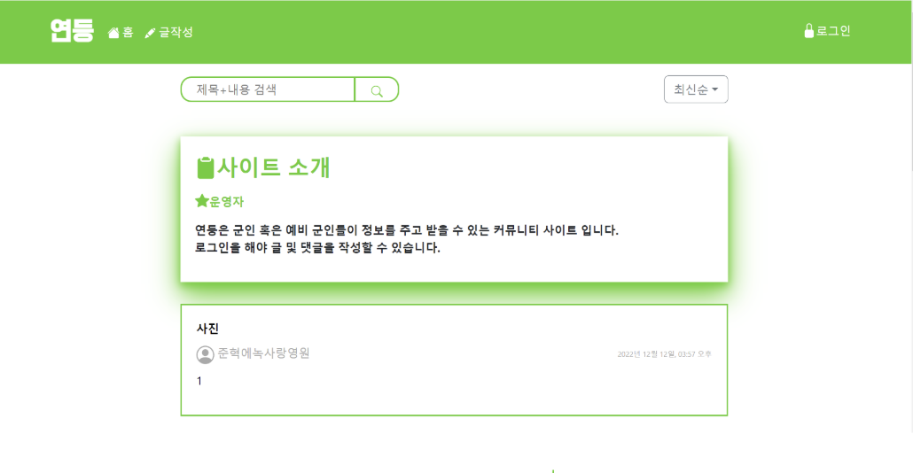
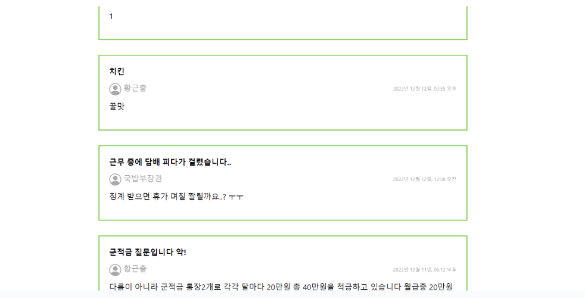
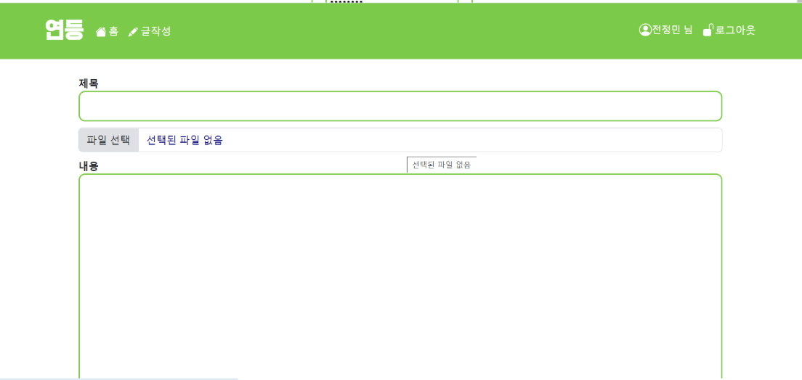
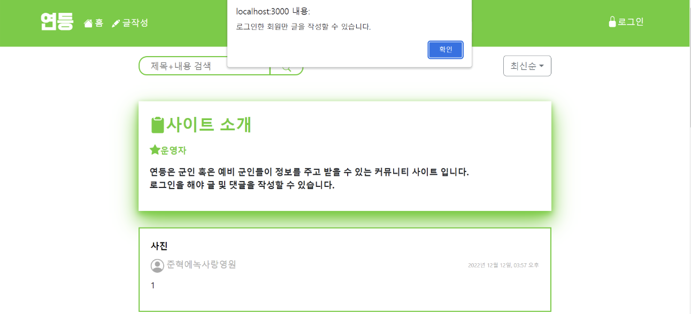
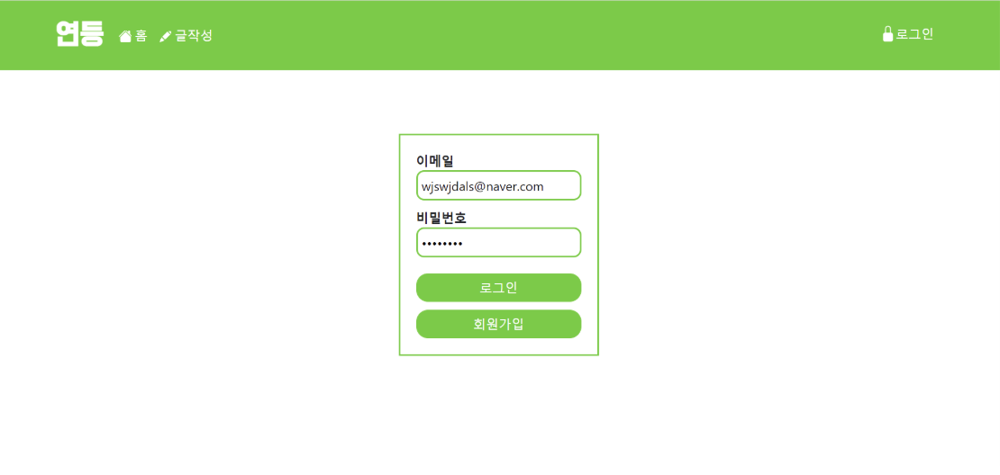
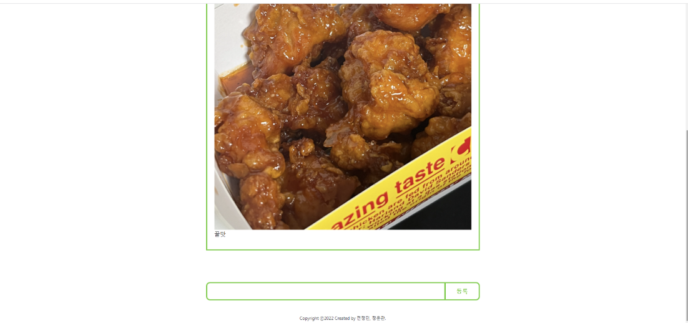

# Soldier Community

A community platform designed for **soldiers**, providing a space to share
information, connect, and support each other.

## Table of Contents

- [Project Overview](#project-overview)
- [Features](#features)
- [Tech Stack](#tech-stack)

## Project Overview

### 🪖 **Community Platform**

- A web-based platform where soldiers can:
  - Share posts, upload photos, and interact with each other.
  - Create accounts and sign-in securely through authentication.
  - Engage in discussions with a CRUD-based bulletin board system.

## Features

- **CRUD Bulletin Board** → Create, Read, Update, and Delete posts.
- **User Authentication** → Signup/Login functionality with secure
  authentication.
- **Photo Upload** → Upload and share images in posts.

## Tech Stack

### 🎨 Frontend

- [React 17.0.2](https://react.dev/)
- [Bootstrap](https://getbootstrap.com/)
- [Redux](https://redux.js.org/)

### ⚙️ Backend

- [Node.js](https://nodejs.org/)
- [Express](https://expressjs.com/)
- [MongoDB](https://www.mongodb.com/)

### 🔐 Authentication & Storage

- [Firebase Authentication](https://firebase.google.com/)
- [Multer](https://github.com/expressjs/multer) for image upload
- Google Drive Storage (via Multer integration) for storing images
